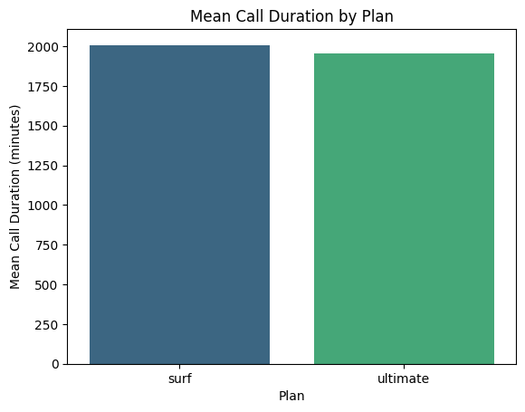

# 📞 Revenue Analysis: Surf vs. Ultimate (Megaline)


## 🔍 Summary
🎯**Objective**: Determine which Megaline plan (Surf or Ultimate) generates the most income.  

🌨️**Conclusion**: Ultimate surpasses Surf in monthly income (p<0.05). [See full report](notebooks/megaline_revenue_analysis.ipynb).

## ⚙️ Instalation
```bash
git clone https://github.com/dannngu/megaline_revenue_analysis.git
pip install -r requirements.txt
```

## 📊 Featured Results

### 📈Income Comparison
- **Ultimate Plan:**
  - Higher median income (~$700/month).
  - High variability (IQR: 100–100–1,400), with users paying up to $2,500 (outliers).

- **Surf Plan**
  - Lower median income (~$200/month).
  - Less variability (IQR: 100–100–200), but with lower profit potential.

<details>
  <summary>📍See more...</summary>
  
  #### 📞 Llamadas y Datos
  - **Call duration**: Surf users have longer calls on average.
  - **Internet consumption**: Surf has higher average consumption, but Ultimate has users with usage peaks (outliers).
  - 
  
  #### 💬 Menssges
  - **Ultimate Plan**: Users send more messages on average (higher median and variability).
  - **Surf Plan**: Fewer messages in general, but some users have extreme use (outliers).

  #### 📉 Pruebas Estadísticas
  - **Hypothesis**: Do Ultimate and Surf revenues differ?
  - **Method**: t-test (α=0.05α=0.05).
  - **Result**: Statistically significant difference (p<0.001p<0.001).


  ### Regional Differences (NY-NJ)
  

</details>


### 🚀 Recommendations
- `Focus marketing on Ultimate`: Attract high-spending users (e.g. urban areas like NY-NJ).
- `Consumption alerts for Surf`: Notify users near the limits to reduce frustration.
- `Customized packages`: Offer data/minute upgrades to frequent users.

### 🛠️ Technologies Used
- Language: Python.
- Libraries: Pandas, Matplotlib/Seaborn, SciPy.
- Visualization: Boxplots, histograms.


> ✨ Note: The data suggests that although Ultimate generates more revenue, Surf is still relevant for users with basic needs.


## 📁 Project Structure
```
megaline_revenue_analysis/
├── data/                   
│   ├── raw/               # Original data (CSV)
│   └── processed/         # Clean and transformed data (parquet/feather)
│
├── notebooks/
│   └── megaline_revenue_analysis.ipynb  # Main notebook
│
├── reports/               
│   ├── figures/           # # Exported graphics (PNG/PDF)
│   │   ├── surf_vs_ultimate_revenue.png
│   │   └── ny_nj_revenue_comparison.png
│   └── megaline_report.pdf  # Executive summary (optional)
│
├── src/                   
│   ├── data_processing.py # Functions for cleaning and transformation
│   └── visualization.py   # Graphics functions
│
├── .gitignore             
├── requirements.txt       # Dependencies (pandas, matplotlib, scipy)
└── README.md              # Project documentation
```
